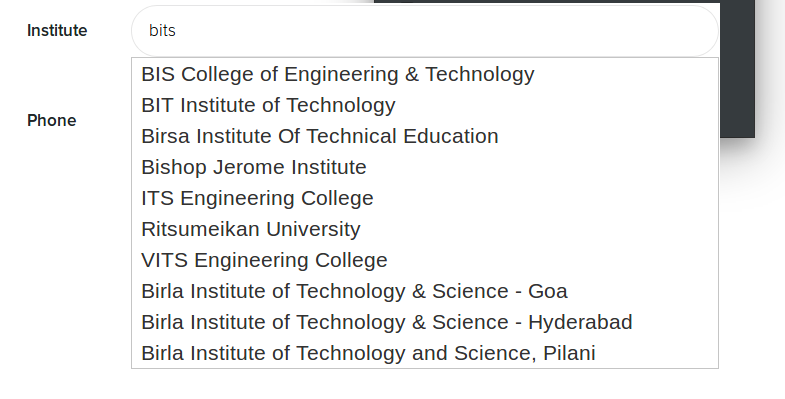

# Typeahead

In order to make data entry easier, we baked in a feature for fuzzy search
based auto-completion for text fields, which looks like this in the default theme:



## How to implement

This doc assumes that you know how to use the provided form mix-in to create forms.
Read about the form mix-in [here](form-mixin) - TODO: Write form mix-in doc.

In your route, when you are rendering a field, pass `typeahead: <name>` parameter
to your field of choice. For example:

```js
params.fields = [];
params.fields.push({
	name: "institute",
	label: "Institute",
	placeholder: "Type to Search",
	editable: true,
	type: "text",
	typeahead: "institutes", // NAME OF THE TYPEAHEAD
});
res.renderState('dashboard/account', params);
```

Next, in `/routes/api/typeahead.js`, append the code for implementing your
typeahead above the `modules.exports` line. When you have loaded your typeahead
data, you should call `registerTypeahead (nameOfTypeahead, dataToSearch, defaultData)`.
Make sure to do this in your callback or promise so that the `dataToSearch`
is loaded successfully. An example code would be:

```js
fs.readFile(path.join(projectroot, 'utils', 'institutes.json'), (err, data) => {
	var institutes = JSON.parse(data).array;
    registerTypeahead('institutes',
        institutes,
        ["None", "Birla Institute of Technology & Science - Hyderabad"]);
});
```

Make sure that `dataToSearch` is an array of strings and that the name of
the typeahead is the same in your router as well as in the `typeahead.js` file.

## Hacks

In order to modify the search strings in your data without modifying the
text that the user sees, you can add additional data enclosed in `{}` so
that it is searched by Fuse but isn't shown to the users.

For example, when we were adding the list of institutes, we added the
acronyms of popular institutes like this in the data:

```json
"{NIT}Motilal Nehru National Institute of Technology",
"Delhi Technological University",
"{BITS}Birla Institute of Technology and Science, Pilani",
"{IIT}Indian Institute of Technology - Delhi",
```

## Internals

By adding a `typeahead="name"` in your field data, the `fieldMixin` creates
HTML to load `/public/static/scripts/typeahead.js` and then attach an
`onKeyUp` event handler on the text field to call the `Typeahead.search()` function.

This sends an HTTP GET request to `/api/typeahead/:name/:query` which is
received by the handler we registered using `registerTypeahead()`. It
does a fuzzy search on the content using [fuse](https://github.com/krisk/Fuse)
and returns the first 10 results to the frontend.

These results are handled by the [jQuery UI's autocomplete plugin](https://jqueryui.com/autocomplete/)
to create a list of items as shown in the image.
